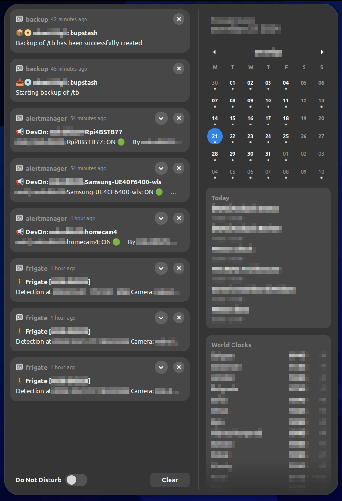
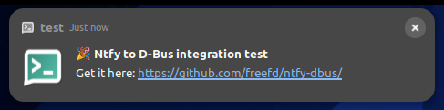

# Integrate Ntfy with D-Bus org.freedesktop.Notifications service

The systemd service to integrate [Ntfy](https://ntfy.sh/) topics over python3 daemon script with Linux DE notifications using [D-Bus](https://www.freedesktop.org/wiki/Software/dbus/):



## Functionality
* Using a [Websocket](https://docs.ntfy.sh/subscribe/api/#websockets) connection to Ntfy server
* Support of a [self-hosted](https://docs.ntfy.sh/install/) Ntfy server
* [Multiple](https://docs.ntfy.sh/subscribe/api/#subscribe-to-multiple-topics) Ntfy topics are allowed
* Ntfy [password based (Basic Auth)](https://docs.ntfy.sh/publish/#username-password) authentication
* Ntfy [token based](https://docs.ntfy.sh/publish/#access-tokens) authentication
* Direct integration with D-Bus without shell wrappers
* Configuration via environment variables
* Configuration via CLI arguments
* Built-in [emojis](https://docs.ntfy.sh/emojis/) support for Ntfy [Tags/X-Tags](https://docs.ntfy.sh/publish/#tags-emojis)
* Running through the systemd timer as a watchdog

## Automated Installation
### Prerequisites
* make
* sed
* python3 with Standard Library
* python3 D-Bus module
* python3 PyYaml module
* python3 Websockets module

### Installation Scenario
The Makefile script is to check the presence of required utils, to create necessary directories if they don't exist, to create a demo configuration, then to install systemd service and timer personally for the current user, to install main executable, and, finally, enable systemd service and timer:

```shell
~> git clone https://github.com/freefd/ntfy-dbus/ /tmp/ntfy-dbus
~> cd /tmp/ntfy-dbus/
~> make install
---  Check of my own prerequisites
[=] All prerequisites have been met

--- Create directories if necessary
[+] /home/username/.config/ntfy-dbus

--- Create demo configuration
[+] /home/username/.config/ntfy-dbus/config

--- Install python files
[+] ntfy_dbus.py
'/tmp/ntfy-dbus/src/ntfy_dbus.py' -> '/home/username/.local/bin/ntfy_dbus.py'

--- Install systemd files
[+] ntfy-dbus.service
'/tmp/ntfy-dbus/src/ntfy-dbus.service' -> '/home/username/.config/systemd/user/ntfy-dbus.service'
[+] ntfy-dbus.timer
'/tmp/ntfy-dbus/src/ntfy-dbus.timer' -> '/home/username/.config/systemd/user/ntfy-dbus.timer'

--- Reload systemd daemon

--- Readme
Please adjust the configuration in /home/username/.config/ntfy-dbus/config
Up-to-date info about the project is available at https://github.com/freefd/ntfy-dbus/
```

Check if the systemd service is running:
```shell
~> systemctl --user is-active ntfy-dbus.service
active
```

The Makefile also supports `uninstall` target:
```shell
~> make help
install
	- Install systemd user files, create demo configuration, copy executable and run
uninstall
	- Uninstall systemd files, delete executable, preserve the configuration
readme
	- README, how to configure
help
	- Show all usable commands
```

But the configuration file will be preserved
```shell
~> make uninstall
---  Check of my own prerequisites
[=] All prerequisites have been met

--- Disable systemd services
[-] ntfy-dbus.service
[-] ntfy-dbus.timer

--- Uninstall systemd files
[-] /home/username/.config/systemd/user/ntfy-dbus.service
[-] /home/username/.config/systemd/user/ntfy-dbus.timer

--- Uninstall python files
[-] /home/username/.local/bin/ntfy_dbus.py

--- Reload systemd daemon
```

## Manual Installation
To perform all the operations Makefile does, you need to create necessary directories:
```shell
~> git clone https://github.com/freefd/ntfy-dbus/ /tmp/ntfy-dbus
~> cd /tmp/ntfy-dbus/
~> mkdir $HOME/.local/bin $HOME/.config/systemd/user $HOME/.config/ntfy-dbus
```

Create demo configuration:
```shell
~> echo -ne "NTFY_DBUS_TOKEN=\nNTFY_DBUS_SERVER=ntfy.sh\nNTFY_DBUS_TOPIC=test\nNTFY_DBUS_APPEND_URL=false\n" > $HOME/.config/ntfy-dbus/config
```

Install python script file:
```shell
~> cp /tmp/ntfy-dbus/src/ntfy_dbus.py $HOME/.local/bin/ntfy_dbus.py
```

Install systemd service and timer, reload systemd and start timer:
```shell
~> cp /tmp/ntfy-dbus/src/*.service $HOME/.config/systemd/user/
~> cp /tmp/ntfy-dbus/src/*.timer $HOME/.config/systemd/user/
~> systemctl --user daemon-reload
~> systemctl --user enable --now ntfy-dbus.service ntfy-dbus.timer
```

Check if the systemd service is running:
```shell
~> systemctl --user is-active ntfy-dbus.service
active
```

## Configuration

Once demo configuration file is installed, you can supply the test notification:

```shell
~> curl -qs -H "X-Title: Ntfy to D-Bus integration test" -H "X-Tags: tada" -d "Get it here: https://github.com/freeusername/ntfy-dbus/" https://ntfy.sh/test
```

Almost immediately you should see the notification from DE similar to the following



> Pay attention, the demo configuration uses `test` topic from the public `ntfy.sh` server and is not recommended for use in production environments for privacy and security reasons.
> Please also read the [documentation](https://docs.ntfy.sh/config/) on how to configure Ntfy server.

The python script can be configured either by environment variables or CLI arguments. The recommended option to configure systemd service is to use environment variables defined in the `~/.config/ntfy-dbus/config` file.
The following list of variables is supported:
* __NTFY_DBUS_TOPIC__ - Specify an individual or multiple comma separated topics on Ntfy server. Default value if not set: `test`.
* __NTFY_DBUS_SERVER__ - Specify Ntfy server, can be either private or public, and <u>MUST NOT CONTAIN a URL scheme prefix</u>. Default value if not set: `ntfy.sh`.
* __NTFY_DBUS_TOKEN__ - Specify [access token](https://docs.ntfy.sh/publish/#access-tokens), it also takes a precedence over the Basic Auth option. Mutually exclusive with next NTFY_DBUS_USERNAME and NTFY_DBUS_PASSWORD variables. Default value if not set: None.
* __NTFY_DBUS_USERNAME__ - Specify [Basic Auth]((https://docs.ntfy.sh/publish/#username-password)) method user name. Mutually exclusive with the NTFY_DBUS_TOKEN variable. Default value if not set: None.
* __NTFY_DBUS_PASSWORD__ - Specify [Basic Auth]((https://docs.ntfy.sh/publish/#username-password)) method user password. Mutually exclusive with the NTFY_DBUS_TOKEN variable. Default value if not set: None.
* __NTFY_DBUS_LOGLEVEL__ - Specify logging level, available values: NOTSET, DEBUG, INFO, WARNING, ERROR, CRITICAL. Default value if not set: INFO.
* __NTFY_DBUS_APPEND_URL__ - Specify whether a clickable URL of Ntfy web application should be added in front of a message. The current implementation of D-Bus integration does not provide support for [actions](https://specifications.freedesktop.org/notification-spec/1.3/basic-design.html#id-1.3.6). Default value if not set: false.

A sample production-like configuration:

```shell
NTFY_DBUS_TOKEN=tk_quv2zom541qth7xyze79ogjl8lrxx
NTFY_DBUS_SERVER=ntfy.domain.tld
NTFY_DBUS_TOPIC=topic1,topic2,topic3
NTFY_DBUS_APPEND_URL=true
```